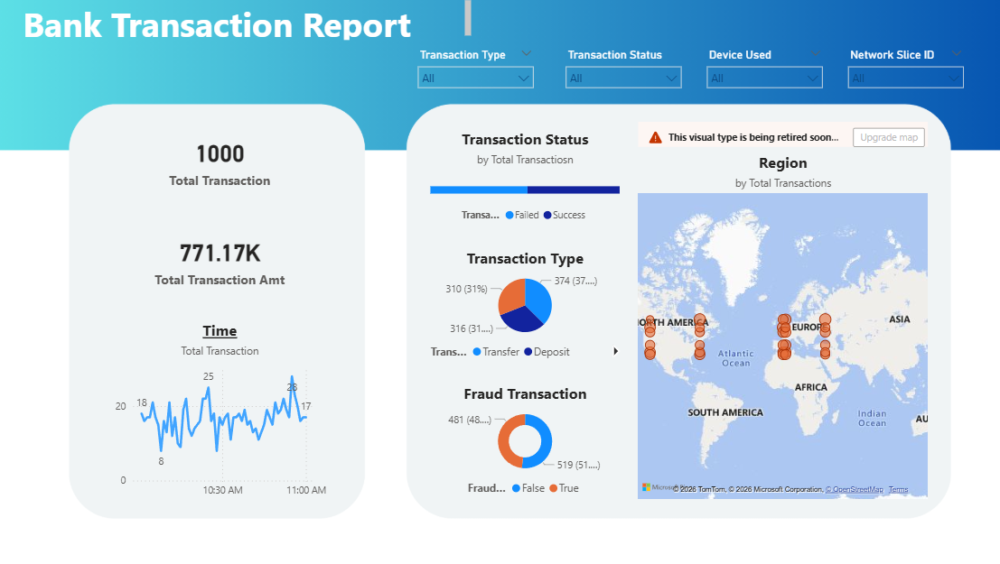
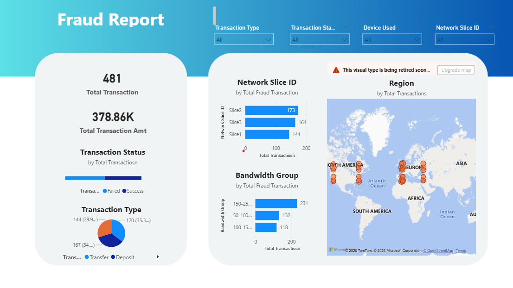
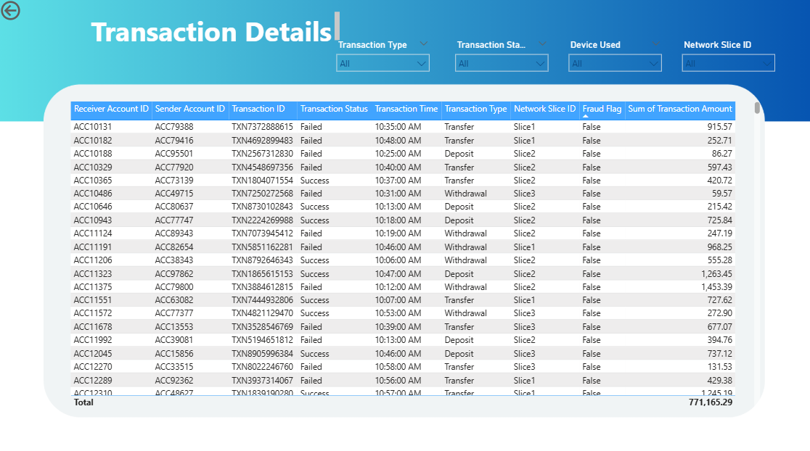

# Financial-Transaction---Risk-&-Fraud-Detection-Analytics-Dashboard

---

## Executive Summary

This project presents an end-to-end financial analytics solution focused on **transaction monitoring and fraud detection** using Power BI.

The dashboard provides a comprehensive view of transaction behavior, fraud patterns, network-level anomalies, and regional distribution to support **data-driven decision-making in digital banking environments**.

Key findings highlight unusually high fraud occurrences, strong correlation with network configurations, and identifiable behavioral patterns across time and geography.

---

## Business Problem

In modern digital banking systems, organizations face challenges such as:

- Increasing **fraudulent transactions**
- Lack of **real-time monitoring systems**
- Difficulty in identifying **pattern-based fraud**
- Poor visibility into **network-level vulnerabilities**
- High **transaction failure rates impacting user experience**

The goal is to build a system that enables:
- Fraud detection
- Transaction performance monitoring
- Risk identification
- Operational optimization

---

## Objectives

- Analyze transaction volume and value distribution  
- Identify fraud patterns and anomalies  
- Evaluate transaction success vs failure rates  
- Understand regional transaction behavior  
- Detect network-based fraud correlations  
- Enable actionable insights for fraud prevention  

---

## Dataset Overview

The dataset consists of simulated banking transaction data with the following key attributes:

- Transaction ID  
- Sender & Receiver Account IDs  
- Transaction Type (Transfer, Deposit, Withdrawal)  
- Transaction Status (Success / Failed)  
- Transaction Time  
- Network Slice ID  
- Bandwidth Group  
- Fraud Flag (True / False)  
- Transaction Amount  

---

## Methodology

### 1. Data Cleaning & Transformation
- Handled missing values  
- Standardized transaction formats  
- Created calculated columns & measures  

### 2. Data Modeling
- Built relationships across transaction attributes  
- Optimized model for Power BI performance  

### 3. Visualization Design
- KPI cards for high-level metrics  
- Time-series charts for trend analysis  
- Pie & bar charts for distribution insights  
- Map visualization for geographic analysis  

### 4. Analytical Focus
- Fraud detection patterns  
- Network-based anomaly detection  
- Transaction behavior segmentation  

---

##  Dashboard Walkthrough

### 1. Bank Transaction Report

- Total transactions and transaction amount KPIs  
- Time-based transaction trends  
- Transaction type distribution  
- Fraud vs non-fraud comparison  
- Regional transaction mapping  

---

### 2. Fraud Analysis Report

- Fraud transaction volume  
- Network Slice analysis  
- Bandwidth group distribution  
- Fraud concentration across regions  
- Transaction type vs fraud relationship  

---

### 3. Transaction Details

- Granular transaction-level dataset  
- Drill-down capability  
- Filters:
  - Transaction type  
  - Status  
  - Device  
  - Network slice  

---

## Key Insights

### Transaction Behavior
- Total transactions: **1000**
- Total transaction value: **~771K**
- Average transaction value: **~771**

Indicates a **mid-value transaction ecosystem**

---

### Transaction Failures
- Significant number of failed transactions observed  

Possible causes:
- Network instability  
- Payment gateway issues  
- Fraud detection blocking  

---

### Transaction Type Distribution
- Balanced split between **Transfer and Deposit**

Indicates:
- Healthy transaction diversity  
- No dependency on a single transaction type  

---

### Fraud Detection
- Fraud transactions ≈ **~48% of total**

Critical Observation:
- Extremely high compared to real-world benchmarks  

Suggests:
- Synthetic dataset OR  
- Highly vulnerable system  

---

### Regional Insights
- High activity in:
  - North America  
  - Europe  
  - Asia  

 These regions act as **primary transaction hubs**

---

### Network-Level Insights
- **Slice2** shows highest fraud activity  
- Bandwidth group **150–250** has highest fraud concentration  

Key Insight:
- Fraud is **pattern-based, not random**

---

### Time-Based Patterns
- Transaction spikes observed at specific intervals  

Indicates:
- Burst transaction activity  
- Potential coordinated fraud attempts  

---

## Recommendations

### Fraud Prevention
- Implement **real-time fraud detection models**  
- Use **behavioral analytics & anomaly detection**  
- Introduce **risk scoring systems**  

---

### Network Optimization
- Monitor high-risk network slices (e.g., Slice2)  
- Flag suspicious bandwidth usage patterns  

---

### Operational Improvements
- Investigate transaction failure clusters  
- Optimize system performance during peak hours  

---

### Regional Strategy
- Identify region-specific fraud trends  
- Deploy geo-based risk controls  

---

## Tools & Technologies

- **Power BI** – Data Visualization & Dashboarding  
- **DAX (Data Analysis Expressions)** – KPI calculations  
- **Data Modeling** – Relationship building  
- **Excel / CSV Dataset** – Data source  

---

## Conclusion

This project demonstrates how data analytics can be leveraged to:

- Detect fraud patterns  
- Monitor transaction systems  
- Identify operational inefficiencies  
- Provide actionable business insights  

---
